# 🎯 Matchmaking Redesign - Masterplan

## Executive Summary

**Vision**: Skillswap soll die führende Plattform für Skill-Austausch und -Lernen werden, wo Nutzer ihre Expertise gegen neue Fähigkeiten tauschen oder für professionelles Training bezahlen können.

**Aktueller Status**: Die Matchmaking-Funktionalität ist zu komplex, unübersichtlich und der Nutzen für User ist nicht klar erkennbar.

**Ziel**: Vereinfachung der User Journey auf 3 klare Schritte: **DISCOVER → CONNECT → LEARN**

---

## 🔴 Identifizierte Probleme

### 1. User Experience Probleme
- **Unklare User Journey**: Nutzer wissen nicht, wo sie anfangen sollen
- **Verwirrende Terminologie**: Match vs Request vs Thread vs Connection
- **Fehlende Skill-Discovery**: Wie finde ich passende Partner?
- **Komplexe UI**: Zu viele Tabs und verschachtelte Seiten (5+ Matchmaking-Seiten)
- **Keine klare Value Proposition**: Was ist der konkrete Nutzen?

### 2. Technische Probleme
- **Inkonsistente Datenstrukturen**: Verschiedene Response-Formate für ähnliche Daten
- **Redundante API-Calls**: Mehrfache Anfragen für zusammenhängende Daten
- **Komplexer Redux State**: Verschachtelte und unübersichtliche State-Struktur
- **Fehlende TypeScript-Typisierung**: Viele `any` Types in kritischen Bereichen

### 3. Business-Impact
- **Niedrige Conversion Rate**: Wenige Nutzer erstellen tatsächlich Matches
- **Hohe Absprungrate**: Nutzer verlassen die Plattform frustriert
- **Support-Aufwand**: Viele Fragen zur Nutzung der Matchmaking-Funktion

---

## 💡 Lösungskonzept

### Kernprinzipien

1. **Dual-Mode System**: Skill-Tausch ODER Bezahlung
2. **Klarheit vor Features**: Weniger, aber verständlichere Funktionen
3. **Mobile-First Design**: Optimiert für Smartphone-Nutzung
4. **Transparente Preisgestaltung**: Klare Angaben zu Kosten/Tausch-Bedingungen

### Die neue Value Proposition

> "Lerne neue Skills von Experten - tausche deine Expertise oder zahle fair für professionelles Training"

### User Personas & Use Cases

#### Persona 1: Der Tauscher (Sarah, 28, Webdesignerin)
- **Kann**: UI/UX Design, Figma, Adobe Creative Suite
- **Will lernen**: React, TypeScript
- **Präferenz**: Skill-Tausch (1:1 Stunden)
- **Journey**: Sucht React-Entwickler → Findet Match → Tauscht Design-Stunden gegen React-Training

#### Persona 2: Der Zahler (Marcus, 35, Unternehmer)
- **Will lernen**: Data Science, Python
- **Präferenz**: Bezahlung (Zeit ist Geld)
- **Budget**: 50-80€ pro Stunde
- **Journey**: Sucht Python-Experten → Filtert nach Preis → Bucht und bezahlt Sessions

#### Persona 3: Der Hybrid (Lisa, 31, Marketing Manager)
- **Kann**: SEO, Content Marketing
- **Will lernen**: Video Editing, Social Media Ads
- **Präferenz**: Flexibel (Tausch oder Bezahlung)
- **Journey**: Bietet SEO gegen Video Editing ODER zahlt für Social Media Training

---

## 🚀 Neue User Journey

### Hauptflow: 3 Schritte zum Erfolg

```mermaid
graph LR
    A[1. DISCOVER] --> B[2. CONNECT] --> C[3. LEARN]
    
    A --> A1[Skill suchen]
    A --> A2[Partner finden]
    A --> A3[Angebot wählen]
    
    B --> B1[Anfrage senden]
    B --> B2[Details klären]
    B --> B3[Vereinbarung treffen]
    
    C --> C1[Session planen]
    C --> C2[Lernen/Lehren]
    C --> C3[Bewerten]
```



### Detaillierter Flow

#### Phase 1: DISCOVER (Entdecken)
1. User gibt ein: "Was möchte ich lernen?"
2. System zeigt verfügbare Partner mit:
   - Expertise-Level
   - Verfügbarkeit
   - Modus: Tausch/Bezahlung/Beides
   - Bei Tausch: Was sie suchen
   - Bei Bezahlung: Preis pro Stunde
3. User filtert nach Präferenzen

#### Phase 2: CONNECT (Verbinden)
1. User sendet Anfrage mit:
   - Persönlicher Nachricht
   - Gewünschter Modus (Tausch/Bezahlung)
   - Bei Tausch: Angebotener Skill
   - Bei Bezahlung: Budget-Bestätigung
2. Partner antwortet (Accept/Reject/Counter)
3. Bei Accept: Verbindung wird erstellt

#### Phase 3: LEARN (Lernen)
1. Partner planen erste Session
2. Video-Call oder persönliches Treffen
3. Nach Session: Bewertung & Feedback
4. Weitere Sessions planen

---

## 📋 Neue Seitenstruktur

### Vereinfachte Navigation (3 Hauptseiten statt 5+)

```
/matchmaking                    → Dashboard (Zentrale Übersicht)
/matchmaking/discover           → Partner finden & Filter
/matchmaking/connections        → Meine Verbindungen verwalten
```

### Seite 1: Matchmaking Dashboard

**URL**: `/matchmaking`

**Komponenten**:
```typescript
interface DashboardSections {
  quickStart: {
    title: "Was möchtest du heute lernen?";
    searchBar: SkillSearchInput;
    suggestedSkills: TrendingSkills[];
  };
  
  myExchanges: {
    active: ActiveConnection[];
    upcoming: ScheduledSession[];
    pendingRequests: number;
  };
  
  myOfferings: {
    skills: OfferedSkill[];
    availability: WeeklyAvailability;
    pricing: PricingSettings;
  };
  
  stats: {
    hoursLearned: number;
    hoursTaught: number;
    skillsAcquired: string[];
    earnings?: number; // Bei Bezahl-Modus
  };
}
```

**Features**:
- Quick-Action Buttons: "Partner finden", "Skill anbieten"
- Notifications Badge für neue Anfragen
- Übersicht über aktive Partnerschaften
- Persönliche Lern-Statistiken

### Seite 2: Discover (Partner finden)

**URL**: `/matchmaking/discover?skill={skillId}`

**Komponenten**:
```typescript
interface DiscoverPage {
  filters: {
    mode: 'exchange' | 'payment' | 'both';
    priceRange?: [min: number, max: number];
    expertiseLevel: Level[];
    availability: TimeSlot[];
    location: 'remote' | 'local' | 'both';
  };
  
  results: PartnerCard[];
  
  sorting: 'relevance' | 'price' | 'rating' | 'availability';
}

interface PartnerCard {
  user: {
    id: string;
    name: string;
    avatar: string;
    rating: number;
    completedSessions: number;
  };
  
  offering: {
    skill: Skill;
    level: 'Beginner' | 'Intermediate' | 'Advanced' | 'Expert';
    experience: string; // "5 Jahre Erfahrung"
  };
  
  terms: {
    mode: 'exchange' | 'payment' | 'both';
    
    // Bei Tausch
    exchange?: {
      seeking: string[]; // Skills die gesucht werden
      ratio: string; // "1:1" oder "2:1" etc.
    };
    
    // Bei Bezahlung
    payment?: {
      rate: number;
      currency: 'EUR' | 'USD';
      packages?: Package[]; // 5er, 10er Pakete
    };
  };
  
  availability: {
    nextSlot: Date;
    weeklyHours: number;
    responseTime: string; // "Antwortet meist in 2 Stunden"
  };
  
  matchScore: number; // 0-100 Kompatibilität
}
```

**Features**:
- Smart Filtering mit Live-Updates
- Match-Score Algorithmus
- "Instant Book" für verifizierte Partner
- Vorschau von Bewertungen
- Quick Message Button

### Seite 3: Connections (Verbindungen)

**URL**: `/matchmaking/connections`

**Komponenten**:
```typescript
interface ConnectionsPage {
  tabs: {
    active: Connection[];      // Aktive Partnerschaften
    pending: {
      incoming: Request[];     // Erhaltene Anfragen
      outgoing: Request[];     // Gesendete Anfragen
    };
    archived: Connection[];    // Beendete Partnerschaften
  };
}

interface Connection {
  id: string;
  partner: User;
  status: 'active' | 'paused' | 'completed';
  
  arrangement: {
    type: 'exchange' | 'payment';
    
    // Bei Tausch
    exchange?: {
      iTeach: Skill;
      iLearn: Skill;
      balance: number; // +2 bedeutet Partner schuldet 2 Stunden
    };
    
    // Bei Bezahlung
    payment?: {
      rate: number;
      totalPaid: number;
      nextPayment?: Date;
    };
  };
  
  sessions: {
    completed: number;
    scheduled: Session[];
    totalHours: number;
  };
  
  communication: {
    unreadMessages: number;
    lastMessage: Date;
  };
}
```

**Features**:
- Session-Kalender Integration
- Balance-Tracker für Tausch
- Payment-History für Bezahlung
- Integrated Chat/Messaging
- Quick Actions: Schedule, Message, Review

---

## 🎨 UI/UX Verbesserungen

### Design Principles

1. **Card-Based Design**: Alle Partner/Connections als übersichtliche Karten
2. **Visual Indicators**: Farben für Modi (Grün=Tausch, Blau=Bezahlung, Lila=Beides)
3. **Progressive Disclosure**: Details nur bei Bedarf zeigen
4. **Mobile-First**: Touch-optimierte Interaktionen
5. **Micro-Interactions**: Smooth Animations für besseres Feedback

### Neue Komponenten

```typescript
// Kern-Komponenten
- SkillSearchAutocomplete     // Intelligente Skill-Suche
- PartnerCard                 // Einheitliche Partner-Darstellung
- ConnectionCard              // Verbindungs-Übersicht
- SessionScheduler            // Termin-Planung
- BalanceTracker             // Stunden-Bilanz (Tausch)
- PaymentWidget              // Bezahl-Integration
- QuickChat                  // In-App Messaging

// Supporting Components
- MatchScoreIndicator        // Visuelle Kompatibilität
- AvailabilityCalendar      // Verfügbarkeits-Anzeige
- PriceComparisonTable      // Preis-Übersicht
- SkillVerificationBadge    // Verifizierte Skills
```

### Mobile App Considerations

- **Swipe Actions**: Links=Ablehnen, Rechts=Annehmen
- **Push Notifications**: Neue Anfragen, Session-Erinnerungen
- **Offline Mode**: Verbindungen lokal speichern
- **QR-Code**: Schnelles Verbinden auf Events

---

## 💰 Monetarisierungs-Integration

### Payment Features

```typescript
interface PaymentOptions {
  directPayment: {
    methods: ['PayPal', 'Stripe', 'SEPA'];
    instantBooking: boolean;
    escrow: boolean; // Geld wird bis Session-Ende gehalten
  };
  
  packages: {
    bulk: Package[];  // 5er, 10er Pakete mit Rabatt
    subscription: Subscription[]; // Monatliche Pakete
  };
  
  credits: {
    system: 'SkillCoins';  // Interne Währung
    conversion: number;     // 1 EUR = 100 SkillCoins
    benefits: string[];     // Vorteile des Credit-Systems
  };
}
```

### Pricing Strategies

1. **Freemium Model**:
   - Free: 3 Skill-Tausch Verbindungen/Monat
   - Premium: Unlimited + Bezahl-Features

2. **Commission Model**:
   - 10% Gebühr auf bezahlte Sessions
   - Kostenlos für Skill-Tausch

3. **Subscription Tiers**:
   - Basic: 9.99€/Monat
   - Pro: 19.99€/Monat (Priority Matching)
   - Business: 49.99€/Monat (Team Features)

---

## 🔧 Technische Implementierung

### Backend Änderungen

```csharp
// Neue, klarere API Endpoints
namespace MatchmakingService.Api.V2
{
    // Discovery
    POST   /api/v2/matchmaking/search           // Partner suchen
    GET    /api/v2/matchmaking/suggestions      // KI-basierte Vorschläge
    
    // Connection Management
    POST   /api/v2/connections/request          // Anfrage senden
    GET    /api/v2/connections                  // Meine Verbindungen
    PATCH  /api/v2/connections/{id}/status      // Accept/Reject/Pause
    
    // Session Management
    POST   /api/v2/sessions/schedule            // Session planen
    POST   /api/v2/sessions/{id}/complete       // Session abschließen
    POST   /api/v2/sessions/{id}/review         // Bewerten
    
    // Payment Integration
    POST   /api/v2/payments/initiate            // Zahlung starten
    GET    /api/v2/payments/history             // Zahlungs-Historie
    POST   /api/v2/payments/refund              // Rückerstattung
}
```

### Frontend State Management

```typescript
// Vereinfachter Redux Slice
interface MatchmakingStateV2 {
  // Discovery
  search: {
    query: SearchQuery;
    results: PartnerCard[];
    filters: FilterSettings;
    isLoading: boolean;
  };
  
  // Connections
  connections: {
    active: Connection[];
    pending: {
      incoming: Request[];
      outgoing: Request[];
    };
    archived: Connection[];
  };
  
  // Sessions
  sessions: {
    upcoming: Session[];
    history: Session[];
  };
  
  // User Settings
  settings: {
    offerings: OfferedSkill[];
    availability: Availability;
    pricing: PricingSettings;
    preferences: MatchPreferences;
  };
}
```

### Database Schema Updates

```sql
-- Neue Tabellen für V2
CREATE TABLE skill_offerings (
    id UUID PRIMARY KEY,
    user_id UUID REFERENCES users(id),
    skill_id UUID REFERENCES skills(id),
    mode VARCHAR(20), -- 'exchange', 'payment', 'both'
    price_per_hour DECIMAL(10,2),
    currency VARCHAR(3),
    is_active BOOLEAN DEFAULT true,
    created_at TIMESTAMP DEFAULT NOW()
);

CREATE TABLE connections (
    id UUID PRIMARY KEY,
    requester_id UUID REFERENCES users(id),
    provider_id UUID REFERENCES users(id),
    skill_id UUID REFERENCES skills(id),
    type VARCHAR(20), -- 'exchange', 'payment'
    status VARCHAR(20), -- 'pending', 'active', 'completed'
    exchange_skill_id UUID, -- For skill exchange
    payment_rate DECIMAL(10,2), -- For payment
    balance_hours INTEGER DEFAULT 0, -- For tracking exchange balance
    created_at TIMESTAMP DEFAULT NOW()
);

CREATE TABLE sessions (
    id UUID PRIMARY KEY,
    connection_id UUID REFERENCES connections(id),
    scheduled_at TIMESTAMP,
    duration_minutes INTEGER,
    status VARCHAR(20),
    meeting_link VARCHAR(500),
    payment_id UUID,
    completed_at TIMESTAMP,
    teacher_id UUID REFERENCES users(id),
    learner_id UUID REFERENCES users(id)
);
```

---

## 📊 Success Metrics

### KPIs zu tracken

1. **User Engagement**
   - Daily Active Users (DAU) in Matchmaking
   - Durchschnittliche Session-Dauer
   - Wiederkehrende Nutzer Rate

2. **Conversion Metrics**
   - Search → Request Conversion Rate
   - Request → Connection Conversion Rate
   - Connection → Session Conversion Rate

3. **Business Metrics**
   - Durchschnittlicher Umsatz pro User
   - Lifetime Value (LTV)
   - Churn Rate

4. **Quality Metrics**
   - Durchschnittliche Bewertung
   - Session Completion Rate
   - User Satisfaction Score (NPS)

### Erfolgs-Benchmarks (nach 6 Monaten)

- 50% Steigerung der Match-Creation Rate
- 30% Reduktion der Absprungrate
- 40% mehr abgeschlossene Sessions
- 25% Umsatzsteigerung durch Payment-Integration

---

## 🚀 Rollout Plan

### Phase 1: Foundation (Woche 1-2)
- [ ] Neues Datenmodell implementieren
- [ ] API V2 Endpoints erstellen
- [ ] Migration Scripts vorbereiten

### Phase 2: Core Features (Woche 3-4)
- [ ] Dashboard Page implementieren
- [ ] Discover Page mit Filtern
- [ ] Connection Management

### Phase 3: Payment Integration (Woche 5-6)
- [ ] Payment Provider Integration
- [ ] Pricing UI Components
- [ ] Transaction Management

### Phase 4: Polish & Testing (Woche 7-8)
- [ ] UI/UX Refinements
- [ ] Performance Optimierung
- [ ] User Testing
- [ ] Bug Fixes

### Phase 5: Launch (Woche 9)
- [ ] Soft Launch mit Beta Users
- [ ] Monitoring Setup
- [ ] Feedback Collection
- [ ] Iterations basierend auf Feedback

---

## 🎯 Zusammenfassung

Die neue Matchmaking-Architektur transformiert Skillswap von einer komplexen, verwirrenden Plattform zu einem klaren, nutzerfreundlichen Marktplatz für Skill-Austausch und -Learning. Durch die Integration von Bezahloptionen neben dem Tausch-Modell erweitern wir die Zielgruppe und schaffen neue Umsatzströme.

**Kernvorteile der Neukonzeption:**

✅ **Klarheit**: 3-Schritt Journey statt verwirrender Navigation  
✅ **Flexibilität**: Tausch ODER Bezahlung  
✅ **Skalierbarkeit**: Vorbereitet für Wachstum  
✅ **Monetarisierung**: Multiple Revenue Streams  
✅ **User Experience**: Intuitive, moderne UI  

**Next Steps:**
1. Review & Approval durch Stakeholder
2. Detaillierte Technical Specs
3. Sprint Planning
4. Entwicklungsstart

---

*Dokument Version: 1.0*  
*Erstellt: 2025-01-11*  
*Autor: Skillswap Development Team*