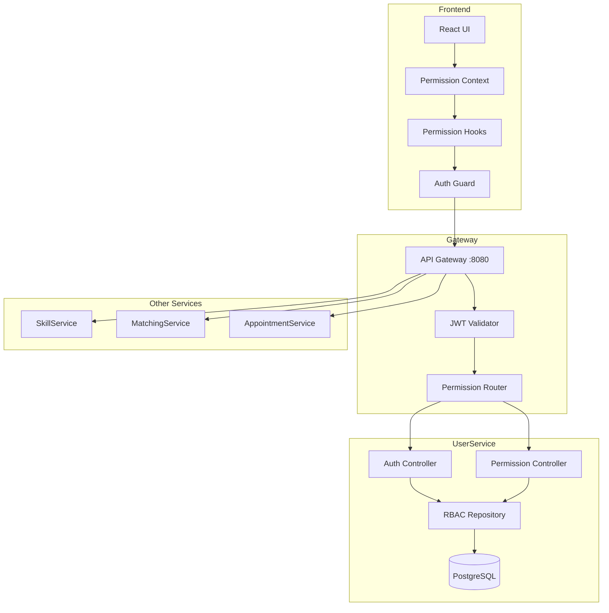

# RBAC (Role-Based Access Control) System Documentation

## 📋 Table of Contents
1. [Overview](#overview)
2. [Architecture](#architecture)
3. [Roles & Permissions](#roles--permissions)
4. [Implementation Flow](#implementation-flow)
5. [JWT Token Structure](#jwt-token-structure)
6. [Service-Level Permissions](#service-level-permissions)
7. [Frontend Implementation](#frontend-implementation)
8. [Admin Dashboard](#admin-dashboard)
9. [Security Considerations](#security-considerations)

## 🎯 Overview

The Skillswap RBAC system provides fine-grained access control across all services using JWT tokens with embedded permissions. The system supports hierarchical roles with inherited permissions and resource-based access control.

## 🏗️ Architecture



## 👥 Roles & Permissions

### Role Hierarchy
```
super_admin (Priority: 1000)
    ├── admin (Priority: 100)
    │   ├── moderator (Priority: 50)
    │   │   └── user (Priority: 10)
```

### Role Definitions

#### 1. Super Admin
- **Purpose**: System administrators with full access
- **Key Permissions**:
  - `system.manage_all`
  - `users.create`
  - `users.delete`
  - `users.update`
  - `roles.create`
  - `roles.delete`
  - `roles.update`
  - `permissions.manage`
  - All admin permissions (inherited)

#### 2. Admin
- **Purpose**: Platform administrators
- **Key Permissions**:
  - `admin.access_dashboard`
  - `users.view_all`
  - `users.block`
  - `users.unblock`
  - `skills.manage_categories`
  - `skills.manage_proficiency_levels`
  - `appointments.view_all`
  - `appointments.cancel_any`
  - `reports.view_all`
  - All moderator permissions (inherited)

#### 3. Moderator
- **Purpose**: Content moderators
- **Key Permissions**:
  - `moderator.access_panel`
  - `users.view_reported`
  - `content.moderate`
  - `skills.verify`
  - `reviews.moderate`
  - `reports.handle`
  - All user permissions (inherited)

#### 4. User
- **Purpose**: Regular platform users
- **Key Permissions**:
  - `profile.view_own`
  - `profile.update_own`
  - `skills.create_own`
  - `skills.update_own`
  - `skills.delete_own`
  - `appointments.create`
  - `appointments.view_own`
  - `appointments.cancel_own`
  - `reviews.create`
  - `messages.send`

### Permission Categories

#### System Permissions
```yaml
system:
  - manage_all              # Super Admin only
  - view_logs              # Admin+
  - manage_settings        # Admin+
  - manage_integrations    # Admin+
```

#### User Management
```yaml
users:
  - create                 # Super Admin only
  - update                 # Super Admin only
  - delete                 # Super Admin only
  - view_all              # Admin+
  - view_reported         # Moderator+
  - block                 # Admin+
  - unblock               # Admin+
  - manage_roles          # Super Admin only
```

#### Skills Management
```yaml
skills:
  - create_own            # All users
  - update_own            # All users
  - delete_own            # All users
  - verify                # Moderator+
  - manage_categories     # Admin+
  - manage_proficiency    # Admin+
```

#### Appointments
```yaml
appointments:
  - create                # All users
  - view_own              # All users
  - cancel_own            # All users
  - view_all              # Admin+
  - cancel_any            # Admin+
```

## 🔄 Implementation Flow

### 1. Authentication Flow
```typescript
// 1. User logs in
POST /api/auth/login
{
  "email": "user@example.com",
  "password": "password123"
}

// 2. Backend validates credentials and generates JWT with permissions
Response:
{
  "accessToken": "eyJ...",  // Contains user info + permissions
  "refreshToken": "...",
  "user": {
    "id": "...",
    "roles": ["admin"],
    "permissions": ["admin.access_dashboard", "users.view_all", ...]
  }
}

// 3. Frontend stores token and permissions
localStorage.setItem('accessToken', token);
permissionContext.setPermissions(permissions);
```

### 2. Authorization Flow
```typescript
// Frontend check
if (hasPermission('admin.access_dashboard')) {
  // Show admin menu
}

// Backend check (in service)
[Authorize(Permission = "admin.access_dashboard")]
public async Task<IActionResult> GetDashboard() { }
```

## 🎫 JWT Token Structure

```json
{
  "header": {
    "alg": "HS256",
    "typ": "JWT"
  },
  "payload": {
    "sub": "user-id-guid",
    "email": "user@example.com",
    "name": "John Doe",
    "roles": ["admin", "moderator"],
    "permissions": [
      "admin.access_dashboard",
      "users.view_all",
      "users.block",
      "skills.manage_categories"
    ],
    "exp": 1234567890,
    "iat": 1234567890,
    "nbf": 1234567890
  }
}
```

## 🔐 Service-Level Permissions

### UserService
```csharp
// Endpoint with permission check
[HttpGet("users")]
[Authorize(Permission = "users.view_all")]
public async Task<IActionResult> GetAllUsers()
{
    // Implementation
}
```

### SkillService
```csharp
// Resource-based permission
[HttpPut("skills/{id}")]
[Authorize]
public async Task<IActionResult> UpdateSkill(Guid id, UpdateSkillRequest request)
{
    // Check if user owns the skill OR has admin permission
    if (!await IsSkillOwner(id) && !HasPermission("skills.update_any"))
    {
        return Forbid();
    }
    // Implementation
}
```

### Gateway Configuration (ocelot.json)
```json
{
  "Routes": [
    {
      "DownstreamPathTemplate": "/api/admin/{everything}",
      "UpstreamPathTemplate": "/api/admin/{everything}",
      "RequiredPermissions": ["admin.access_dashboard"],
      "AuthenticationOptions": {
        "AuthenticationProviderKey": "Bearer",
        "RequiredClaims": {
          "permissions": "admin.access_dashboard"
        }
      }
    }
  ]
}
```

## 💻 Frontend Implementation

### Permission Context
```typescript
// contexts/PermissionContext.tsx
interface PermissionContextType {
  permissions: string[];
  roles: string[];
  hasPermission: (permission: string) => boolean;
  hasAnyPermission: (permissions: string[]) => boolean;
  hasAllPermissions: (permissions: string[]) => boolean;
  hasRole: (role: string) => boolean;
  isAdmin: boolean;
  isModerator: boolean;
  isSuperAdmin: boolean;
}
```

### Permission Hooks
```typescript
// hooks/usePermissions.ts
export const usePermissions = () => {
  const context = useContext(PermissionContext);
  
  const canAccessAdmin = () => 
    context.hasPermission('admin.access_dashboard');
    
  const canManageUsers = () => 
    context.hasPermission('users.manage');
    
  const canModerateContent = () => 
    context.hasAnyPermission(['content.moderate', 'admin.access_dashboard']);
    
  return {
    ...context,
    canAccessAdmin,
    canManageUsers,
    canModerateContent
  };
};
```

### Protected Routes
```typescript
// components/ProtectedRoute.tsx
const ProtectedRoute: React.FC<{
  permission?: string;
  role?: string;
  children: React.ReactNode;
}> = ({ permission, role, children }) => {
  const { hasPermission, hasRole } = usePermissions();
  
  if (permission && !hasPermission(permission)) {
    return <Navigate to="/403" />;
  }
  
  if (role && !hasRole(role)) {
    return <Navigate to="/403" />;
  }
  
  return <>{children}</>;
};

// Usage
<ProtectedRoute permission="admin.access_dashboard">
  <AdminDashboard />
</ProtectedRoute>
```

### Dynamic UI Components
```typescript
// Sidebar with permission-based items
const Sidebar = () => {
  const { hasPermission, isAdmin, isModerator } = usePermissions();
  
  return (
    <nav>
      <MenuItem to="/dashboard" icon={<DashboardIcon />}>
        Dashboard
      </MenuItem>
      
      {hasPermission('skills.create_own') && (
        <MenuItem to="/skills" icon={<SkillIcon />}>
          My Skills
        </MenuItem>
      )}
      
      {isAdmin && (
        <MenuSection title="Administration">
          <MenuItem to="/admin/users" icon={<UsersIcon />}>
            User Management
          </MenuItem>
          <MenuItem to="/admin/skills" icon={<CategoryIcon />}>
            Skill Categories
          </MenuItem>
        </MenuSection>
      )}
      
      {isModerator && (
        <MenuSection title="Moderation">
          <MenuItem to="/moderate/reports" icon={<ReportIcon />}>
            Reports
          </MenuItem>
        </MenuSection>
      )}
    </nav>
  );
};
```

## 📊 Admin Dashboard

### Required Admin Pages

#### 1. User Management (`/admin/users`)
- **Permissions Required**: `users.view_all`, `users.manage`
- **Features**:
  - List all users with pagination and filters
  - View user details and activity
  - Block/Unblock users
  - Assign/Remove roles (Super Admin only)
  - Reset passwords
  - View user permissions
  - Export user data

#### 2. Role Management (`/admin/roles`) - Super Admin Only
- **Permissions Required**: `roles.manage`
- **Features**:
  - Create new roles
  - Edit role permissions
  - Delete roles
  - View role hierarchy
  - Assign permissions to roles

#### 3. Skill Categories (`/admin/skills/categories`)
- **Permissions Required**: `skills.manage_categories`
- **Features**:
  - Create/Edit/Delete categories
  - Set category icons
  - Manage subcategories
  - Set category visibility

#### 4. Proficiency Levels (`/admin/skills/proficiency`)
- **Permissions Required**: `skills.manage_proficiency`
- **Features**:
  - Define proficiency levels
  - Set level descriptions
  - Configure level requirements

#### 5. System Settings (`/admin/settings`)
- **Permissions Required**: `system.manage_settings`
- **Features**:
  - Platform configuration
  - Email templates
  - Notification settings
  - API rate limits

#### 6. Reports Dashboard (`/admin/reports`)
- **Permissions Required**: `reports.view_all`
- **Features**:
  - User activity reports
  - Skill exchange statistics
  - Platform usage metrics
  - Financial reports (if applicable)

## 🔒 Security Considerations

### 1. Token Security
- Short-lived access tokens (15 minutes)
- Longer refresh tokens (7 days)
- Secure token storage (httpOnly cookies preferred)
- Token rotation on refresh

### 2. Permission Caching
- Cache permissions in Redis for performance
- Invalidate cache on permission changes
- Use cache-aside pattern

### 3. Audit Logging
- Log all permission changes
- Track role assignments
- Monitor failed authorization attempts
- Regular security audits

### 4. Best Practices
- Principle of least privilege
- Regular permission reviews
- Separate admin accounts
- Two-factor authentication for admins
- IP whitelisting for super admins

## 🚀 Implementation Checklist

### Phase 1: Backend Foundation
- [x] Create RBAC database models
- [x] Implement permission repository
- [x] Create permission commands/queries
- [ ] Add permissions to JWT claims
- [ ] Create permission middleware
- [ ] Implement authorization attributes

### Phase 2: Service Integration
- [ ] Update UserService authentication
- [ ] Add permission checks to SkillService
- [ ] Add permission checks to AppointmentService
- [ ] Add permission checks to MatchingService
- [ ] Update Gateway routing

### Phase 3: Frontend Implementation
- [ ] Create permission context
- [ ] Implement permission hooks
- [ ] Add protected routes
- [ ] Update navigation components
- [ ] Create admin dashboard layout

### Phase 4: Admin Features
- [ ] User management UI
- [ ] Role management UI
- [ ] Skill category management
- [ ] Proficiency level management
- [ ] System settings UI

### Phase 5: Testing & Deployment
- [ ] Unit tests for permissions
- [ ] Integration tests
- [ ] E2E permission flows
- [ ] Security audit
- [ ] Production deployment

## 📝 Example Permission Checks

### Frontend Examples
```typescript
// In component
const { hasPermission } = usePermissions();

if (hasPermission('users.block')) {
  // Show block button
}

// In route
<Route 
  path="/admin" 
  element={
    <RequirePermission permission="admin.access_dashboard">
      <AdminLayout />
    </RequirePermission>
  }
/>
```

### Backend Examples
```csharp
// Method-level authorization
[HttpPost("users/{id}/block")]
[RequirePermission("users.block")]
public async Task<IActionResult> BlockUser(Guid id)

// Manual check in code
if (!User.HasPermission("users.view_all"))
{
    return Forbid();
}

// Resource-based authorization
var authResult = await _authorizationService
    .AuthorizeAsync(User, skill, "SkillOwnerPolicy");
```

## 🔄 Migration Strategy

### Step 1: Deploy RBAC System
1. Deploy database changes
2. Run permission seed data
3. Assign default roles to existing users

### Step 2: Gradual Rollout
1. Enable for super admins first
2. Test all permission flows
3. Enable for admins
4. Enable for moderators
5. Full rollout to all users

### Step 3: Monitor & Adjust
1. Monitor authorization failures
2. Adjust permissions as needed
3. Gather user feedback
4. Optimize performance

## 📚 References

- [OWASP Authorization Cheat Sheet](https://cheatsheetseries.owasp.org/cheatsheets/Authorization_Cheat_Sheet.html)
- [JWT Best Practices](https://tools.ietf.org/html/rfc8725)
- [RBAC vs ABAC](https://www.okta.com/identity-101/rbac-vs-abac/)